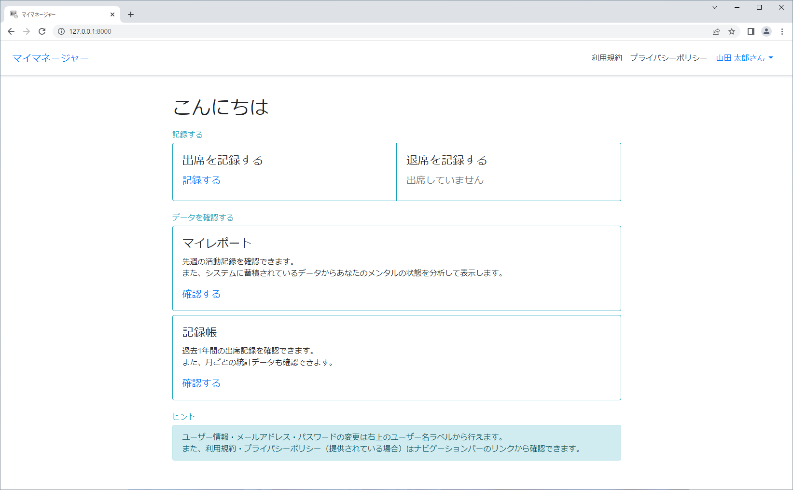

# マイマネージャー
チームメンバーそれぞれの作業時間とメンタルの状態を記録することができるウェブアプリ。



## アプリケーションの種類について
マイマネージャーはPythonで実装されたWebアプリケーションフレームワークのDjangoを基盤にしたウェブアプリです。  
プログラムファイルをダウンロードして任意のサーバーで実行するだけで、インターネットやローカルネットワーク上で簡単にウェブベースのサービスを立ち上げることができます。
## このアプリケーションでできること
- ウェブブラウザから出席時・退席時に打刻をする
- 自分の過去1年間の出席記録を確認する
- Airtableと連携して、各メンバーの出席状況を視覚的に確認したり、記録をCSVファイルにエクスポートしたり、API経由で他サービスと組み合わせる
- 打刻をする際に予め用意された質問に答えることによってメンタルの状態を自動的に判定する
- システムに記録されたデータに基づいて一人一人にメンタルヘルスについてのレポートを表示する（それによって過労などを防止する）
- PC用拡張機能を使用して記録のし忘れを防止したり、退席時間についてのリマインダーを表示する
## 使い始める
**前提条件：Python 3.10以上、PostgreSQL 14以上がインストール済み**
1. 下のリンクから最新のプログラムをダウンロードしてそれを解凍してください。  
[https://github.com/bigbamboo-jp/my-manager-ja/releases](https://github.com/bigbamboo-jp/my-manager-ja/releases)
1. config/`settings.py`にデータベース（PostgreSQL）とAirtable（オプション）の認証情報を書き込んでください。  
    **Airtableとの連携について**  
    このアプリケーションでAirtableのベースを読み書きするにはテーブル名・列名の設定も行う必要があります。  
    ※以下のリンク先のテンプレートを使用する場合は設定不要です（Copy base ボタンを押すとコピーできます）。  
    [https://airtable.com/shrRCYwNlHhpOvfbw](https://airtable.com/shrRCYwNlHhpOvfbw)
1. `manage.py`があるディレクトリで以下のコマンドを実行してください。
    ```
    # Windows or macOS
    python -m venv .venv

    # Linux
    python3 -m venv .venv

    # Windows
    Set-ExecutionPolicy -ExecutionPolicy RemoteSigned -Scope CurrentUser
    .venv\Scripts\Activate.ps1
    
    # macOS or Linux
    source djangox/bin/activate
    ```
1. プロンプトの前に`(.venv)`が表示されていることを確認して、以下のコマンドを実行してください。
    ```
    (.venv) $ pip install -r requirements.txt
    (.venv) $ python manage.py migrate
    (.venv) $ python manage.py createsuperuser
    (.venv) $ python manage.py runserver
    # Starting development server at http://127.0.0.1:8000/
    ```
1. ウェブブラウザで [http://127.0.0.1:8000/](http://127.0.0.1:8000/) にアクセスするとアプリケーションを使用できます。
> ヒント：サイト名の変更などは管理サイト（[http://127.0.0.1:8000/admin/](http://127.0.0.1:8000/admin/)）で行うことができます。
## 定期処理のスケジューリング
このアプリケーションには定期的に行わなければいけない処理を記述したシェルスクリプト（`routine_processing.sh`）が付属しています。  
システムによって定期処理が自動で行われるようにするには、プログラムファイルがあるディレクトリのパスを書き込んだシェルスクリプトをcronに登録してください。  
※シェルスクリプトはMacとLinuxでのみ使用できます。
## PC用拡張機能
このアプリケーションはWindows専用ソフトウェア「My Manager Extension」を組み合わせることでより便利に使うことができます。  
「My Manager Extension」について、詳しくは以下のリンク先をご覧ください。  
[https://github.com/bigbamboo-jp/my-manager-extension-ja](https://github.com/bigbamboo-jp/my-manager-extension-ja)
## 他言語への対応について
現在、このプロジェクトはアプリケーション・ドキュメント共に日本語版のみ製作しています。  
今後、時間ができたときに他言語版も製作して公開する予定です。
## ライセンス
このアプリケーションを開発する際に使用したテンプレートであるDjangoX（[https://github.com/wsvincent/djangox](https://github.com/wsvincent/djangox)）のライセンスは[LICENSE](LICENSE)を参照してください。  
マイマネージャー自体のライセンスは[MY MANAGER LICENSE](MY-MANAGER-LICENSE)を参照してください。